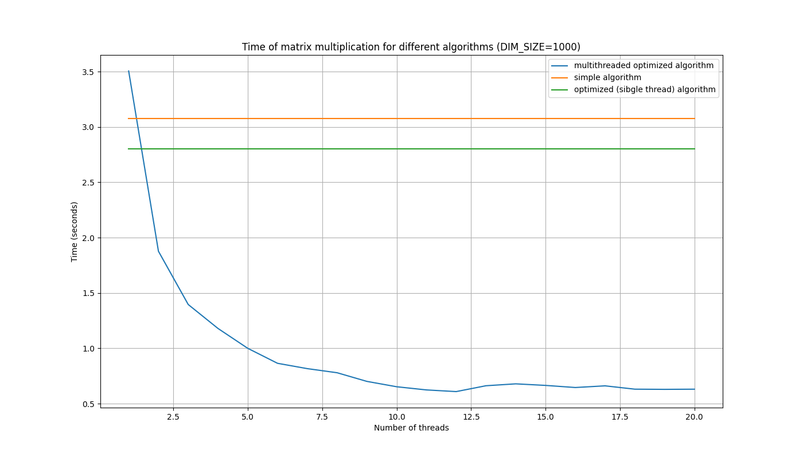

# 

# Cache-friendly multi-threaded blocking matrix multiplication

## 3 algorithms were realized:
### __Simple__: single thread, without transposing, not cache-friendly (many L1D-misses)
### __Optimized__: single thread, with transposing, cache-friendly (number of L1D-misses was decreased)
### __Multi-threaded__: many threads, transposing, blocking (blocks are sized to fit in cache), cache-friendly

### (all calculations about cache were performed for AMD Ryzen 5 3600 processor with L1D cache size equal to 192KiB)
# 

# Usage:
### Program generates 2 random matrices with shapes (DIM_SIZE, SIM_SIZE) and multiplies them with specified algo
## There is a Makefile in root with options:
### `make build` - builds executable in `bin` directory
### `make run-simple` - runs simple algo and prints time
### `make run-optimized` - runs optimized algo and prints time
### `make run-multithreaded` - runs multithreaded algo and prints time
### `make run-all` - runs all algorithms, checks answers equality and prints times and acceleration of multithreaded algo over simple
### `make cachegrind-simple` - runs `cachegrind` tool from valgrind over simple algo
### `make cachegrind-optimized` - runs `cachegrind` tool from valgrind over optimized algo
### `make cachegrind-multithreaded` - runs `cachegrind` tool from valgrind over multithreaded algo
#
# Example:
### `make cachegrind-multithreaded DIM_SIZE=500 THREADS=8`
#
# `cachegrind` results
## The most important cachegrind output with DIM_SIZE=500, THREADS=8:
## __simple algo__
##### `==19245== D   refs:      1,897,577,430  (1,767,560,029 rd   + 130,017,401 wr)`
##### `==19245== D1  misses:      112,673,338  (  112,328,787 rd   +     344,551 wr)`
##### `==19245== LLd misses:           96,761  (        2,278 rd   +      94,483 wr)`
##### `==19245== D1  miss rate:           5.9% (          6.4%     +         0.3%  )`
##### `==19245== LLd miss rate:           0.0% (          0.0%     +         0.1%  )`
## __optimized algo__
##### `==19256== D   refs:      1,899,580,176  (1,769,562,382 rd   + 130,017,794 wr)`
##### `==19256== D1  misses:       15,988,240  (   15,690,983 rd   +     297,257 wr)`
##### `==19256== LLd misses:          127,980  (        2,273 rd   +     125,707 wr)`
##### `==19256== D1  miss rate:           0.8% (          0.9%     +         0.2%  )`
##### `==19256== LLd miss rate:           0.0% (          0.0%     +         0.1%  )`
## __multithreaded algo__
##### `==19267== D   refs:      2,899,165,494  (2,769,383,079 rd   + 129,782,415 wr)`
##### `==19267== D1  misses:       16,548,747  (   16,247,000 rd   +     301,747 wr)`
##### `==19267== LLd misses:          128,303  (        2,308 rd   +     125,995 wr)`
##### `==19267== D1  miss rate:           0.6% (          0.6%     +         0.2%  )`
##### `==19267== LLd miss rate:           0.0% (          0.0%     +         0.1%  )`

## Conclusion: optimized and multithreaded algorithms are really more cache-friendly than simple because they have pretty less L1D cache misses
#
# Graphs of times and accelerations

### It is obviously that after 12 threads there is no acceleration because I have 12 threads in processor locally. Everything else is quite good - acceleration is good despite the fact that it is not linear.